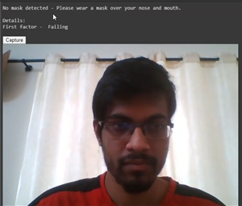
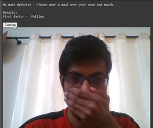
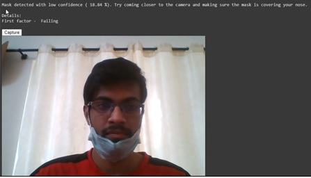
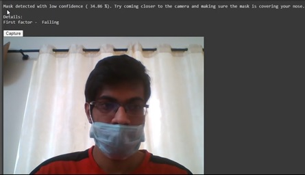
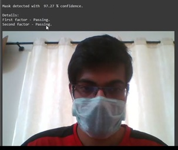

# Personal_Face_Mask_Detection_V3
Face Mask detection for a a specific user that uses a 2-Factor approach. Repo includes both a Google Colab Notebook containing a tutorial and the necessary code for your own Personal Face Mask Detecion. Newly added folder contains the code that utilizes OpenCV for **Real Time** Face Mask Detection.

# Please let me know if you use this work

Link - [Personal_Face_Mask_Detection_V3](https://colab.research.google.com/github/shreyas-bk/Personal_Face_Mask_Detection_V3/blob/master/Personal_Face_Mask_Detection_V3.ipynb)

Video link - [Personal_Face_Mask_Detection_V3](https://www.linkedin.com/posts/shreyas-kera-027727178_machinelearning-facemaskdetection-tensorflow-activity-6692002676055658496-vN2O)

Reddit Post - [Personal_Face_Mask_Detection_V3](https://www.reddit.com/r/learnmachinelearning/comments/hww564/hi_guys_ive_made_a_personalized_face_mask/)

# Example Results

 - Case 1: No Mask [fail case]
 
 
 
 - Case 2: Hand Covering Mouth [fail case]
 
 
 
 - Case 3: Mask worn but not covering Mouth nor Nose [fail case]
 
 
 
 - Case 4: Mask worn but not covering Nose [fail case]
 
 
 
 - Case 5: Mask worn properly over mouth and nose [pass case]
 
 

